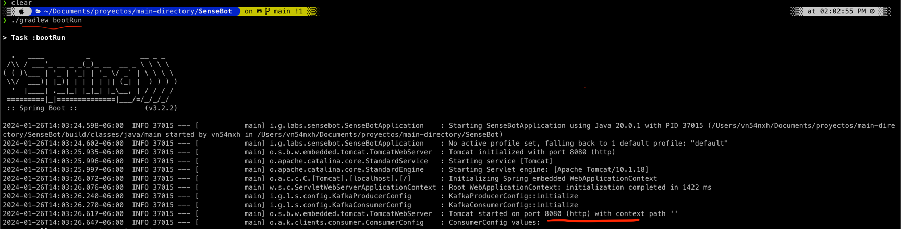
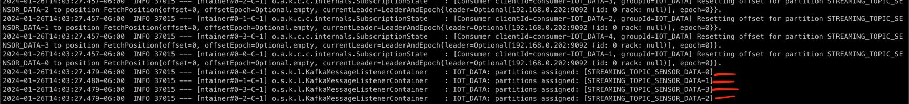

# Kafka and Spring Boot Introduction

## Table of Contents
- [Introduction](#introduction)
- [Features](#features)
- [Getting Started](#getting-started)
  - [Installing and Starting Apache Kafka](#installing-and-starting-apache-kafka)
  - [Up and Running](#up-and-running)
- [License](#license)

## Introduction

Welcome to the Kafka and Spring Boot Introduction project! This project serves as a practical introduction to using Kafka with Spring Boot for real-time data streaming. It demonstrates how to produce data to a Kafka topic and implement consumers to process that data. Additionally, it showcases the generation of sensor data for Internet of Things (IoT) applications and the implementation of backpressure mechanisms for data generation.

## Features

- **Kafka Integration**: Seamless integration of Apache Kafka with Spring Boot for message streaming.
- **Data Production**: Demonstrates data production to a Kafka topic, simulating IoT sensor data.
- **Consumer Implementation**: Illustrates the implementation of Kafka consumers for processing incoming data.
- **Backpressure Mechanism**: Introduces a backpressure mechanism to control the rate of data generation.

## Getting Started

Follow these steps to get started with the project:

## Installing and Starting Apache Kafka

Before you begin, ensure that you have the following prerequisites installed on your system:

### **Java**
1. Kafka is built with Java, so you need to have Java installed. You can check your Java version using the following command:

    ```bash
      java -version
    ```
### **Kafka**
1. Visit the [Apache Kafka downloads](https://kafka.apache.org/downloads) page and choose the version you want to download. Click on the binary version (e.g., "Scala 2.13") to download the Kafka binary.
2. Once the download is complete, extract the Kafka archive to a directory of your choice. For example:
    ```shell
      tar -xzf kafka_2.13-YOUR_VERSION.tgz
    ```
Replace kafka_2.13-YOUR_VERSION.tgz with the actual filename of the Kafka archive you downloaded.
### **Start ZooKeeper**
Kafka uses ZooKeeper for distributed coordination. You need to start ZooKeeper before starting Kafka. You can use the ZooKeeper that comes bundled with Kafka for development purposes.

1. Navigate to the Kafka directory:
    ```shell
      cd kafka_2.13-YOUR_VERSION
    ```
2. Start ZooKeeper by running the following command:
    ```shell
      bin/zookeeper-server-start.sh config/zookeeper.properties
    ```
ZooKeeper should start and run on the default port (2181).

### **Start Kafka Server**
Now, you can start the Kafka server.
1. In the same Kafka directory, open a new terminal window/tab and start the Kafka server with the following command:
    ```shell
      bin/kafka-server-start.sh config/server.properties
    ```
The Kafka server will start and run on the default port (9092).

### **Create a Kafka Topic**
1. To test your Kafka installation, you can create a Kafka topic. Open a new terminal window/tab and navigate to the Kafka directory:
    ```shell
      cd kafka_2.13-YOUR_VERSION
    ```
2. Then, create a Kafka topic named "test" with the following command:
    ```shell
      bin/kafka-topics.sh --create --topic test --bootstrap-server localhost:9092 --replication-factor 1 --partitions 1
    ```
Replace "test" with the name of your desired topic.

### Produce and Consume Messages
You can now produce and consume messages to/from the "test" topic to verify that Kafka is working correctly. Open new terminal windows/tabs and use the following commands:

1. To produce messages:
    ```shell
      bin/kafka-console-producer.sh --topic test --bootstrap-server localhost:9092
    ```
2. To consume messages:
    ```shell
      bin/kafka-console-consumer.sh --topic test --from-beginning --bootstrap-server localhost:9092
    ```
You can start typing messages in the producer terminal, and they should appear in the consumer terminal.
That's it! You've successfully installed and started Apache Kafka on your system. You can now begin using Kafka for your real-time data streaming applications.

## Build Project
0. Create a topic to be used by the Application
    ```shell
      bin/kafka-topics.sh --create --topic STREAMING_TOPIC_SENSOR_DATA --bootstrap-server localhost:9092 --replication-factor 1 --partitions 4
        WARNING: Due to limitations in metric names, topics with a period ('.') or underscore ('_') could collide. To avoid issues it is best to use either, but not both.
        Created topic STREAMING_TOPIC_SENSOR_DATA.
    ```
1. Download checkout base code
    ```shell
      git clone https://github.com/Laboratorios-Gigabyte/SenseBot.git
    ```
2. Navigate to the project directory and build the project using Gradle
   - Build the Project
      ```shell
        ./gradlew build
      ```
   - Clean Build
      ```shell
        ./gradlew clean build
      ```
   - Run Tests
      ```shell
        ./gradlew test
      ```
   - Build and Run the Application
      ```shell
        ./gradlew bootRun
      ```
   - Dependency Management: Gradle can help you manage dependencies. To download dependencies specified in your build.gradle file, run
      ```shell
        ./gradlew dependencies
      ```
For most scenarios just run **Build and run the application** step.

Remember to replace **./gradlew** with **gradlew.bat** on Windows if you're using the Windows command prompt.

## Up and Running
As we can see here after running **Build and run the Application**

In this image we can see that app is started on port **8080**
- 

In this image we can see Kafka consumers have been assigned a partition
- 